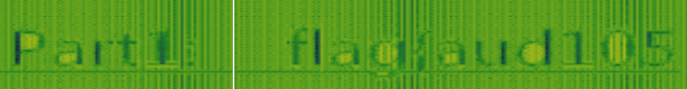
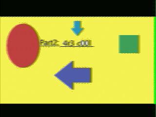

# Sonic Hide and Seek
Category: #Forensic 

Difficulty: Medium

> From the apollo moon landing in 1969 to people using Deepfake to fool others, the use of technology has changed. Anyways, use your skills to uncover the deep secrets of the moon landing from the given data. Adios amigo.

---
They provided us with a [`.wav`](hideandseek.wav) file.

### Spectrogram
Anytime I encounter a `.wav` file, the first thing that comes to my mind is checking the spectrogram. Using **Sonic Visualizer**, I found the first part of the flag in the spectrogram.

>Part 1: `flag{aud105`

### SSTV
From the spectrogram, I figured the flag was split into parts. The nature of the first part of the spectrogram, plus a nod to the Apollo moon landing, hinted at SSTV encoding. So, I just used the [*sstv*](https://github.com/colaclanth/sstv) tool to decode it.
```bash
sstv -d hideandseek.wav -o part2.png
```

> [!tip] **Slow Scan Television**
> 
> For those who don't know, SSTV stands for Slow Scan Television. It's a method of transmitting still images or video over radio frequencies in a manner that allows them to be received and displayed in real-time. Instead of transmitting full-motion video, SSTV sends still images one line at a time.
> >SSTV encoding has an unique spectrogram.


There we go, the second part:

> Part2: `_4r3_c00l_`
### Deepsound
Honestly, I tried a bunch of stuff to dig up the last part, but nothing clicked. Finally, my teammate came through and uncovered the last piece of the flag using [*DeepSound*](https://github.com/oneplus-x/DeepSound-2.0).
> Part3: `4r5n't_th3y?}``

## Flag
And there you have it—the flag:

> Flag: `flag{aud105_4r3_c00l_4r5n't_th3y?}`