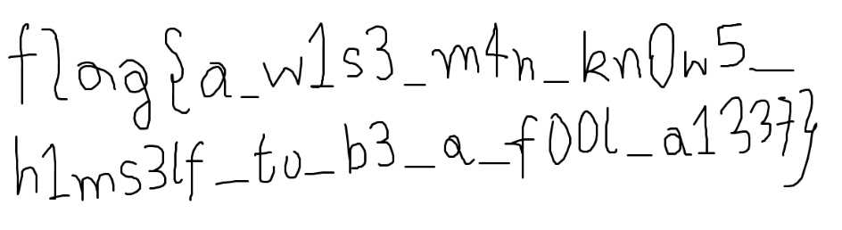

# The Shakespearean Mouse
Category: #Forensic 

Difficulty: #Hard #UpSolve

> wend f’rward with this quest of yours, f’r thee shalt findeth the flag at the endeth

---
Two files [`out.bmp`](out.bmp) and [`TheBackdoorLore`](TheBackdoorLore) was given. Opening the [`TheBackdoorLore`](TheBackdoorLore) file revealed a text file.

I began with the `bmp` file, experimenting with various steganographic tools; however, none of them produced any results. Consequently, I shifted my focus to the text file.
### Shakespearean Language
Initially, I attempted to identify any suspicious-looking strings that might provide a hint. Suddenly, one particular line caught my eye.
> Antonio, ***a stack*** that represents the present and past.

I remembered Rockstar, an esoteric programming language designed to make code resemble a rock song. I wondered if the content could be related to such a language. A quick google search led me to another esolang called [Shakespeare](https://esolangs.org/wiki/Shakespeare).

Using this [online interpreter](https://esolangpark.vercel.app/ide/shakespeare), I got the following output,
>Hey guys i hope you loved shakespearean english, i always did. Anyways here is the password you might need, ohh not easily 4f440a001006a49f24a7de53c04eca3f79aef851ac58e460c9630d044277c8b0. Use it well ;)
### Reversing the Hash
We got a password `4f440a0010...` which has a length of 32 characters, awfully like a hash. Again googling around, I stumbled upon [this link](https://q9f.github.io/secp256k1.cr/Secp256k1/Util.html#keccak%28data%3ANum%7CBytes%7CString%2Centropy%3D256%29%3ANum-instance-method) where the corresponding password was revealed as `0xdeadbeef`.
## UpSolve
Even after grabbing the password, I kept trying different steganographic tools without any luck. I even went so far as to download the original `jpg` image, trying to crack the steganographic algorithm used. But unfortunately, I found myself in a rabbit hole. In the end, as time ran out, I was unable to solve it 😔😔.
### Extracting the Mouse
I had searched through various stego tools, but couldn't find anything that worked in this case. As it turns out, the process was done using [**OpenStego**](https://www.openstego.com/), which ironically doesn't even mention the `bmp` format on its main page. When using OpenStego, it generates a zip file containing two files, `finaldon.rec` and `instructions.txt`.

Upon inspecting `finaldon.rec`, it became apparent that it recorded mouse movements. So, here's where the _mouse_ comes into play. I discovered a [website](https://automacrorecorder.com/) (found in the hexdump of the `.rec` file) that executes the file, causing the mouse pointer to move; sometimes even while pressing. By using any drawing software, the flag can be obtained.
## Flag
And there you have it—the flag:

> Flag: `flag{a_w1s3_m4n_kn0w5_h1ms3lf_to_b3_a_f00l_a1337}`